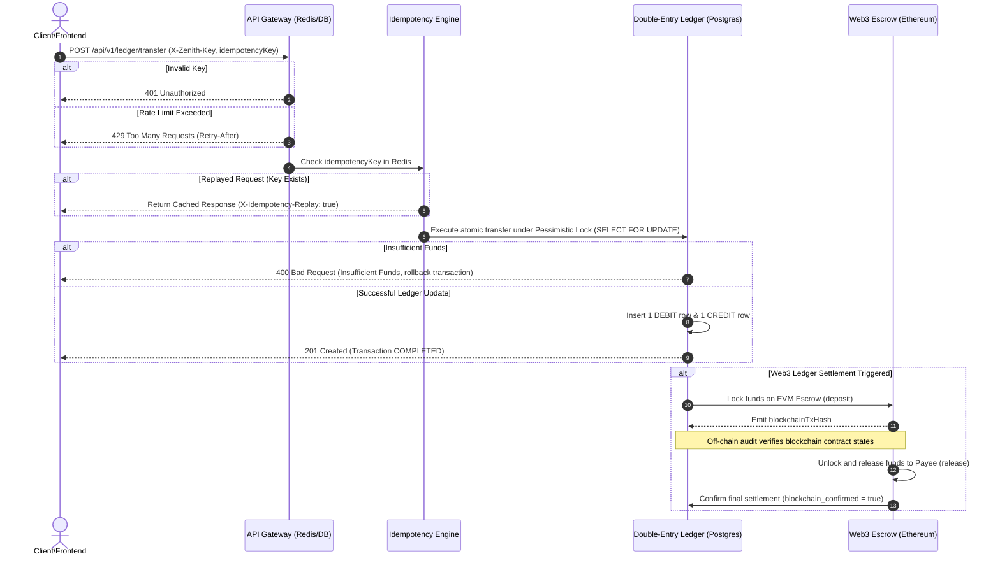

# ⚡ Zenith — High-Performance FinTech Settlement Engine

> A production-grade, double-entry financial settlement platform built with **Java 21 + Spring Boot 3 + PostgreSQL + Redis + Ethereum (Solidity/Web3j) + React/Vite Frontend + Kubernetes**.

---

## 🎯 Kyu Banaya Hai? (Why Zenith?)

In modern FinTech and payment systems, **consistency, speed, and safety are non-negotiable**. Zenith was engineered from the ground up to solve the most critical challenges in high-throughput ledger operations:

1. **The Double-Spend Problem:** Preventing concurrent ledger updates from withdrawing more money than an account actually holds.
2. **Race Conditions:** Avoiding conflicts during parallel transaction processing.
3. **Atomic Consistency:** Ensuring that any money debited from a source account is *always* credited to the destination account in a single, transaction-safe atomic operation.
4. **Idempotent API Requests:** Ensuring that network retries (e.g., clicking a "Pay" button twice) do not create duplicate charges or transfers.
5. **Real-time Hybrid Blockchain Settlement:** Bridging high-speed internal ledger entries with decentralized blockchain-based escrow mechanisms.

---

## 🏛️ Architecture & System Design (Architecture Kya Hai?)

Zenith consists of **5 cohesive, high-performance modules** working together seamlessly:

```
                                  ┌───────────────────────────┐
                                  │   CLIENT / WEB FRONTEND   │
                                  │   (Vite React Dashboard)  │
                                  └─────────────┬─────────────┘
                                                │ X-Zenith-Key header
                                                ▼
┌─────────────────────────────────────────────────────────────────────────────────────────────┐
│ 🔑 MODULE 1: API GATEWAY (ApiKeyInterceptor + RateLimiterService)                           │
│ • Secure SHA-256 API Key hashing (never stored in raw text).                                │
│ • Dual-level caching: Redis Cache (microsecond lookups) ──► DB Fallback.                    │
│ • Atomic Token-bucket rate limiting per tier enforced via an atomic Lua script in Redis.   │
│   - FREE: 5 req/s  |  PRO: 100 req/s  |  ENTERPRISE: 1000 req/s                             │
└───────────────────────────────────────────────┬─────────────────────────────────────────────┘
                                                │
                                                ▼
┌─────────────────────────────────────────────────────────────────────────────────────────────┐
│ 🛡️ MODULE 2: IDEMPOTENCY ASPECT (AOP @Idempotent + Redis)                                    │
│ • Prevents duplicate transaction processing when clients perform retries.                   │
│ • Intercepts requests using Aspect-Oriented Programming (AOP).                              │
│ • Uses Redis to cache responses for 24 hours. Second click → instant replayed response.      │
└───────────────────────────────────────────────┬─────────────────────────────────────────────┘
                                                │
                                                ▼
┌─────────────────────────────────────────────────────────────────────────────────────────────┐
│ 💰 MODULE 3: DOUBLE-ENTRY BOOKKEEPING LEDGER (LedgerService + PostgreSQL 16)                 │
│ • Every transaction creates exactly two `LedgerEntry` rows: 1 DEBIT (-) and 1 CREDIT (+).    │
│ • Ledger Invariant: SUM(amount) across a transaction's debit and credit is always ZERO.    │
│ • Database Isolation Level: REPEATABLE_READ + Pessimistic Locking (`SELECT FOR UPDATE`).     │
│ • Zero overdrafts allowed; strict balance checks prevent any negative balances.             │
└───────────────────────────────────────────────┬─────────────────────────────────────────────┘
                                                │
                                                ▼
┌─────────────────────────────────────────────────────────────────────────────────────────────┐
│ ⛓️ MODULE 4: HYBRID WEB3 SETTLEMENT (Web3Service + ZenithEscrow.sol)                        │
│ • Solidty Smart Contract deployed on EVM (e.g., Ethereum/Sepolia).                           │
│ • Automatically deposits payments in escrow and releases them upon off-chain verification.   │
│   - deposit(id, payee) ──► release(id) ──► confirmBlockchainSettlement()                    │
│ • Flags ledger transactions as `blockchain_confirmed = true` upon network finality.         │
└─────────────────────────────────────────────────────────────────────────────────────────────┘
```

---

## 🔄 Transaction Life-cycle & Flow (Flow Kya Hai?)

Here is the exact operational sequence when a client requests a money transfer:



---

## 📂 Project Structure (Kya Kya Hai?)

```
Zenith/
├── src/main/java/com/zenith/
│   ├── ZenithApplication.java               # Spring Boot entry point
│   ├── config/
│   │   ├── ZenithProperties.java            # Config properties mapping
│   │   └── RedisConfig.java                 # Redis connection & pools configuration
│   ├── gateway/                             # 🔑 MODULE 1: GATEWAY & RATE LIMITER
│   │   ├── model/ApiKey.java
│   │   ├── repository/ApiKeyRepository.java
│   │   ├── service/ApiKeyService.java       # Cache lookup (Redis -> DB fallback)
│   │   ├── service/RateLimiterService.java  # Token-bucket script execution in Redis
│   │   └── interceptor/ApiKeyInterceptor.java# Header extractor & interceptor
│   ├── ledger/                              # 💰 MODULE 2: DOUBLE-ENTRY BOOKKEEPING
│   │   ├── model/Account.java               # Accounts (CHECKING, ESCROW, FEE)
│   │   ├── model/LedgerEntry.java           # DEBIT and CREDIT logs
│   │   ├── model/Transaction.java           # Transaction metadata headers
│   │   ├── repository/AccountRepository.java # Pessimistic locking queries
│   │   ├── service/LedgerService.java       # Core atomic double-entry logic
│   │   └── controller/LedgerController.java
│   ├── idempotency/                         # 🛡️ MODULE 3: REQUEST DEDUPLICATION
│   │   ├── Idempotent.java                  # Custom annotation
│   │   ├── IdempotencyAspect.java           # AOP interceptor aspect
│   │   └── IdempotencyService.java          # Redis response store
│   └── web3/                                # ⛓️ MODULE 4: BLOCKCHAIN BRIDGE
│       ├── Web3Service.java                 # Web3j contract orchestrator
│       ├── Web3Controller.java              # Blockchain RPC status endpoints
│       └── ZenithEscrow.sol                 # Solidity Escrow Smart Contract
├── frontend/                                # 🎨 REACT FRONTEND
│   ├── src/components/Dashboard.jsx        # Admin analytics, ledgers, & logs
│   ├── src/components/Checkout.jsx         # Customer simulated checkout modal
│   └── package.json
├── k8s/                                     # 🐳 KUBERNETES CONFIGS (HPA, Deployment, Probes)
├── Dockerfile                               # Production multi-stage Docker build
├── docker-compose.yml                       # Full-stack developer compose file
├── demo.sh                                  # Real-time ledger execution script
└── pom.xml                                  # Maven project configuration
```

---

## 🚀 Kese Run Karega & Kese Chalega? (How to Run)

Choose one of the two setups below to run the entire project.

### Method A: Running Locally (No Docker Required)

This is the recommended local development setup.

#### 1. Start Databases & Services via Homebrew
Ensure you have Homebrew installed, then spin up **PostgreSQL 16** and **Redis**:
```bash
# Install services (if not installed)
brew install postgresql@16 redis

# Start services in the background
brew services start postgresql@16
brew services start redis
```

#### 2. Create the Database & User
Log in to PostgreSQL and create the user and database as configured in `application.yml`:
```bash
psql -d postgres -c "CREATE USER zenith_user WITH PASSWORD 'zenith_secret';"
psql -d postgres -c "CREATE DATABASE zenith OWNER zenith_user;"
psql -d postgres -c "GRANT ALL PRIVILEGES ON DATABASE zenith TO zenith_user;"
```

#### 3. Run the Backend Settlement Engine
Set `JAVA_HOME` to Java 21 and run the Spring Boot application using Maven:
```bash
export JAVA_HOME=/opt/homebrew/opt/openjdk@21/libexec/openjdk.jdk/Contents/Home
./mvnw spring-boot:run
```
*The backend will boot up, Flyway will run schema migrations, and it will be available on **http://localhost:8080**.*

#### 4. Run the React Frontend
Open a new terminal window, navigate to the `frontend/` directory, install dependencies, and start the Vite dev server:
```bash
cd frontend
npm install
npm run dev
```
*The React client is now up and running on **http://localhost:5173**!*

---

### Method B: Running with Docker Compose

If you have Docker installed and running:
```bash
# Build and spin up PostgreSQL, Redis, Backend, and Frontend containers automatically
docker compose up -d
```
*Access the dashboard at **http://localhost:5173** and the backend at **http://localhost:8080**.*

---

## 🧪 Seeding & Verifying the Ledger (Demo Run)

To instantly verify that your ledger is working, we provide an automated demo script:

```bash
# Run the automated transaction test
./demo.sh
```

**What this script does:**
1. Creates a **Source Account (`ZNT-001`)** with **$1,000,000.00**.
2. Creates a **Destination Account (`ZNT-002`)** with **$0.00**.
3. Fires a **Double-Entry Transfer of $250.00** from `ZNT-001` to `ZNT-002`.
4. Outputs the atomic transaction logs and verifies final database balances.

---

## 🛡️ Robust Security & Controls

| Vector | Mitigating Control |
| :--- | :--- |
| **API Authentication** | Secure SHA-256 hashed API key lookups with microsecond Redis caching. |
| **Rate Limiting** | Multi-tier token-bucket algorithms running inside atomic Lua scripts in Redis to prevent race conditions. |
| **Double-Spend Protection** | PostgreSQL pessimistic locking (`SELECT FOR UPDATE`) under strict `REPEATABLE_READ` transaction boundaries. |
| **Double-Payment Protection**| Unique client-side transaction `idempotencyKey` values cached for 24 hours. |
| **Reentrancy (Smart Contract)**| Strictly adheres to the **Checks-Effects-Interactions (CEI)** pattern + `nonReentrant` modifiers in Solidity. |

---

> Built with ⚡ by the Zenith Engineering Team. Happy Coding!
